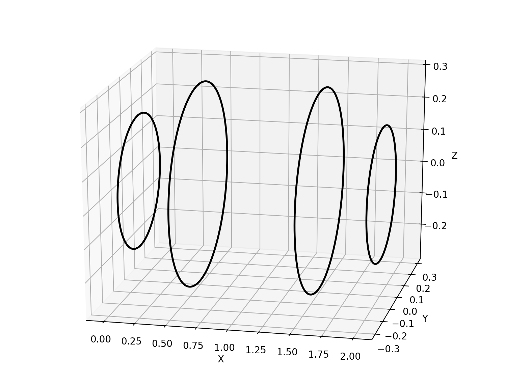
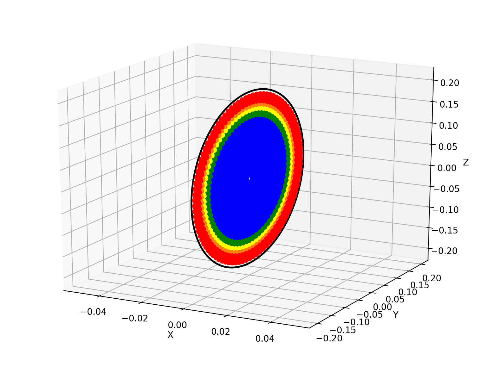
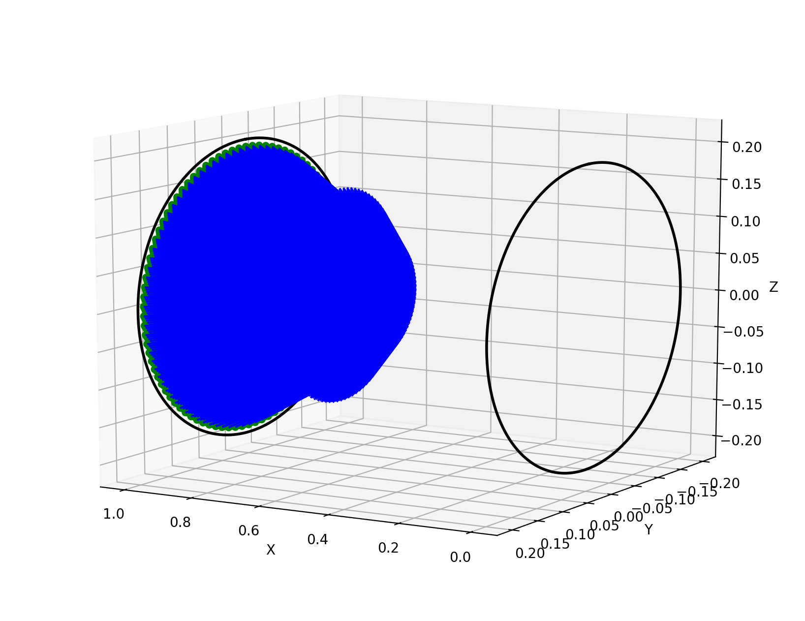
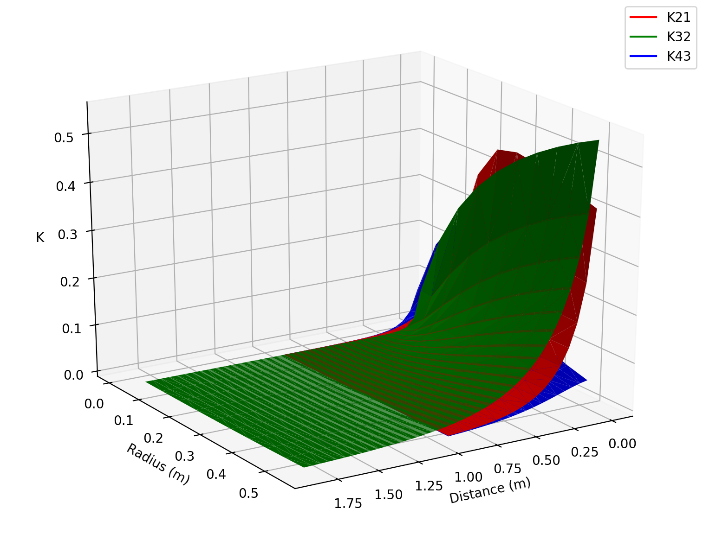
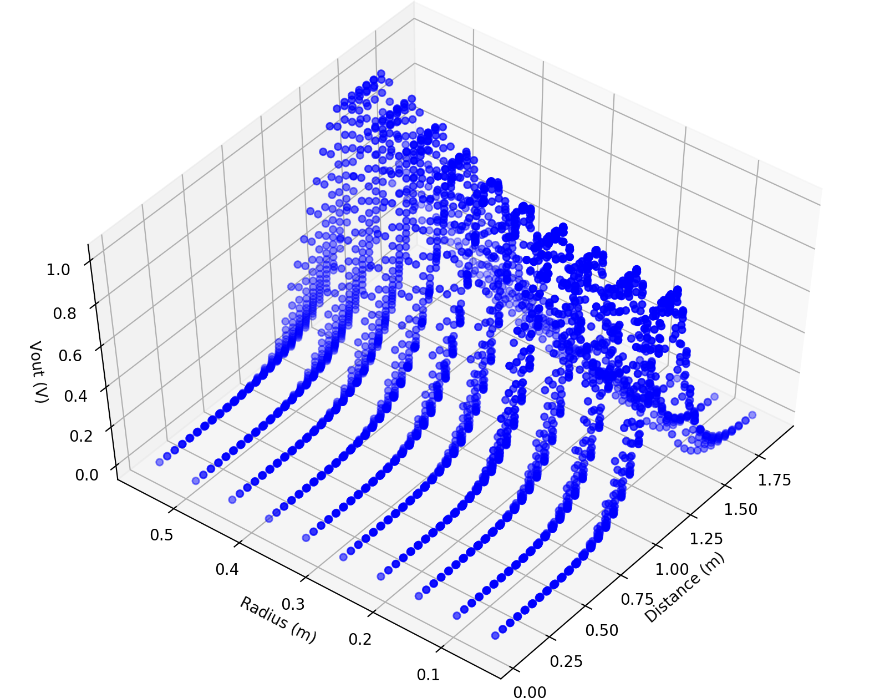

# Wireless Power Transfer
This is an academic competition project, where the goal is to create the most efficient magnetically coupled system in order to transfer the most power possible from the transmitting coil to the recieving coil. The distance between the transmitting and recieving coils, as well as the frequency, is set. We can use the concept of a magnetic lilypad, optimizing the insertion of two other symmetric coils into the system in order to maximize the output power. It is not enough to simulate this, all components will be fabricated and tested against all others, the results are below. The computational methods of accomplishing this are up to us, let's use Python!

## Theory
Using the geometry of a coil (a loop with N turns), we can use Biot-Savart's law, which allows us to calculate the magnetic field vector solution around the conductive wire. Loops are simple enough to simplify these calculations, but the purpose of this project is demonstrate our understanding, and so a more general solution is to find a way to calculate the magnetic field for a generic geometry. The way in which this is implemented is by discretizing the loop, by which one sufficiently small segment of the loop will be roughly equivalent to a straight wire, simplifying the Biot-Savart calculation for each loop. 

## Optimization
We can see from the calculations of mutual inductance between multiple coils that the parameters used to maximize output power would involve the placement and size of each coil. This is the primary focus of this optimization. By utilizing symmetry, we can greatly simplify the bounds of these optimizations.

## Results
This project transferred the most power to the recieving coil out of all other projects, using only 1/5 of the coductive material as the next best project. Check out the images below to see demonstrations.

## Demo

